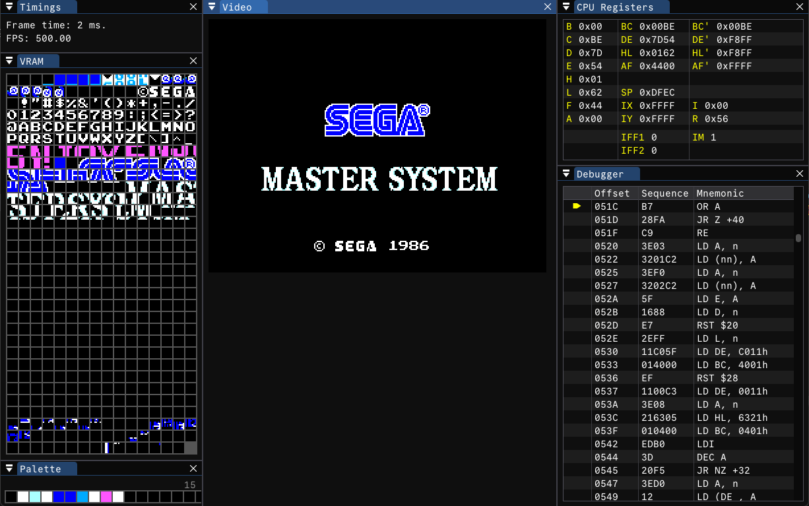

# ZSMS2

An unfinished SMS2 emulator in Zig.

> [!WARNING]  
> This project is provided as-is and it is no longer maintained because of a lack of time or interest.

Notes:
- The Z80 emulation works and it is extensively tested and passed [SingleStepTests/z80](https://github.com/SingleStepTests/z80)
  and all the main test roms like: z80ccf, z80doc, z80full, z80memptr, zexall, zexdoc, and others. The test ROMs are not redistributed in this repo
  but mirrors to many of the can be found [here](https://github.com/redcode/Z80/wiki/Tests)
- The VDP works and passes the tests from the available VDP test roms (e.g [SMSVDPTest](https://www.smspower.org/Homebrew/SMSVDPTest-SMS))
- PSG implementation is missing
- **A proper main loop is missing, `debugger.zig` is glued together with prayers to test the thing. Changes may be necessary to run.**
  - The debugger and disasm is rudimentary and largely incorrect/incomplete.
- Some stuff in test may be hardcoded (test rom paths, ...) or incomplete.

🚧 WIP 🚧

## References
- https://www.smspower.org/Development
- https://github.com/redcode/Z80 which was was crucial to get the z80 emulation right
